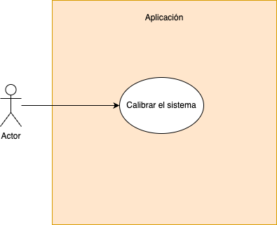
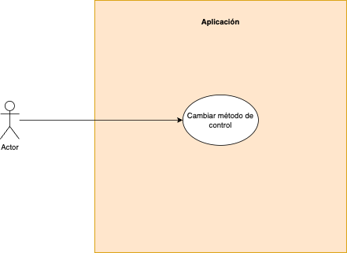
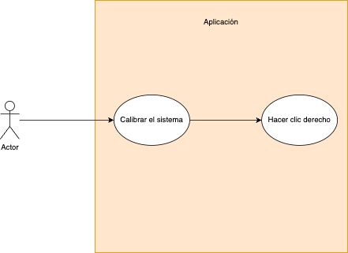
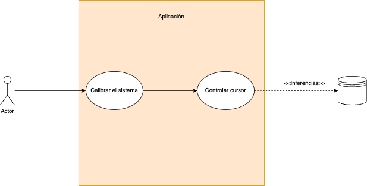
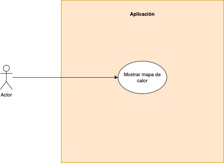
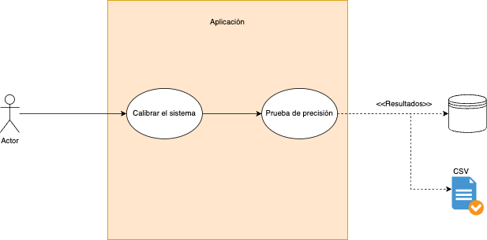

## Finalidad

Esta carpeta tiene como finalidad almacenar los distintos casos de uso del sistema.

## Calibración del sistema

## Cambiar método de control

## Clic derecho

## Clic izquierdo

## Controlar el cursor

## Mostrar mapa de calor

## Prueba de precisión

